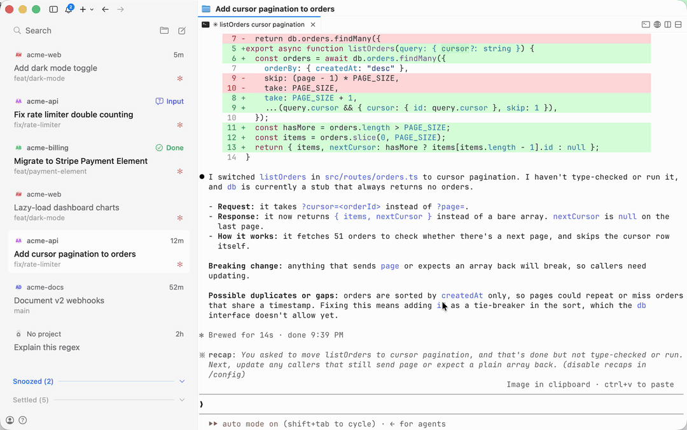

# cmux-t3-sidebar



> [!NOTE]
> Not affiliated with T3 Code. Heavily inspired by [T3 Code](https://github.com/pingdotgg/t3code)'s sidebar; thanks to the T3 team for building it.

## Setup

Requires cmux 0.64.25 or later.

1. Copy `t3code.js` into cmux's sidebars folder:

   ```bash
   mkdir -p ~/.config/cmux/sidebars && cp t3code.js ~/.config/cmux/sidebars/
   ```

2. In cmux, right-click the sidebar toggle and pick **t3code**.
3. Recommended: merge `cmux.example.json` into `~/.config/cmux/cmux.json`. It turns on Agent Hibernation, which pauses idle agents and resumes them with `claude --resume` when you open their thread again. It also sets a matching background and names threads after their conversation.
4. Recommended: install the Claude Code hook. Without it, a thread stays **Working** after you interrupt Claude, and a settled thread's Claude comes back without its original flags (see below):

   ```bash
   cp claude-turn-end.sh ~/.config/cmux/ && chmod +x ~/.config/cmux/claude-turn-end.sh
   ```

   Then merge `claude-settings.example.json` into `~/.claude/settings.json` and restart your Claude sessions. A session picks the hook up when it starts or resumes.

Settled threads don't keep Claude running: the sidebar exits it, and starts the same session again when you open the thread.

Settings such as auto-settle days, sleeping settled threads, and light or dark mode are at the top of `t3code.js`.
